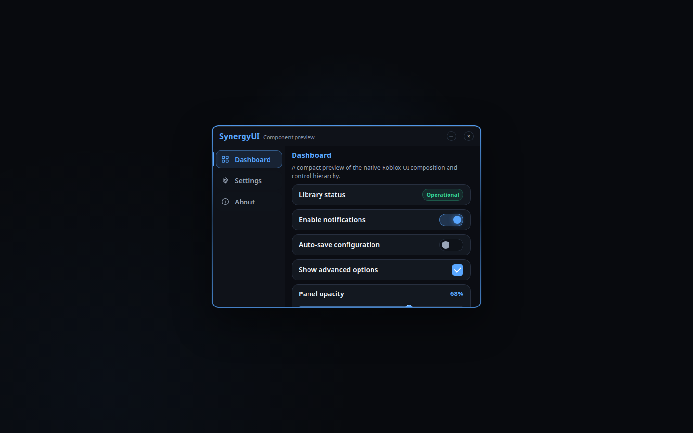

# SynergyUI Preview

SynergyUI is a dark, theme-aware Roblox UI library with modular tabs, overlays and animated controls. This folder includes an interactive browser preview that mirrors the default `Dark` theme and the 560 × 380 window layout defined in `source.lua`.

Open [`preview.html`](preview.html) to try the tabs, toggles, checkbox, slider, dropdown, color picker, keybind control, minimize button and close/reopen behavior.
